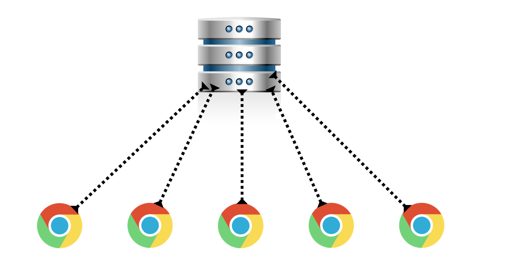
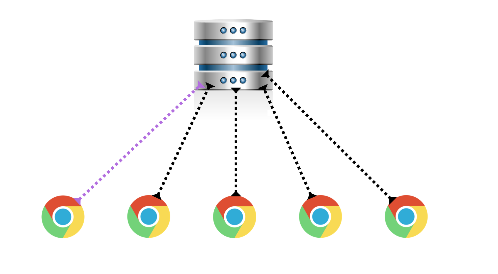
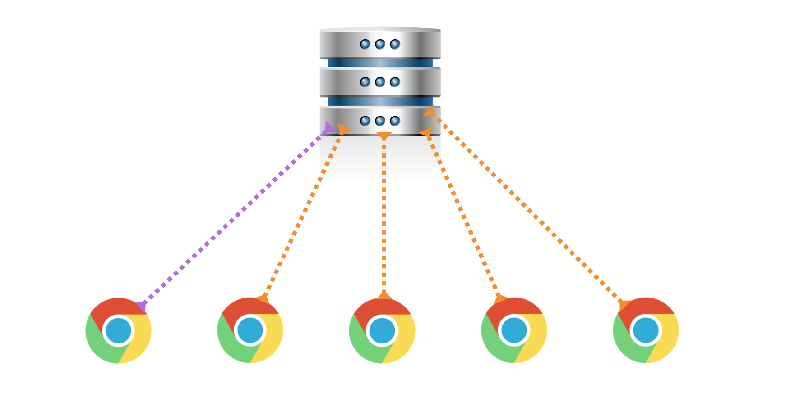

# World Wide WhiteBoard

## Introducción

### Qué estamos Construyendo

En este workshop, vamos a estar explorando conceptos y tecnologías realmente excitantes, incluendo el elemento `<canvas>` de HTML5, `EventEmmitter`s y, el mejor de todos, `socket.io`!

Nuestra aplicación es llamada World Wide WhiteBoard - una pizarra blanca que podés dibujar con otras personas... en la Internet! Ahora, eso si que suena bien.

Empecemos. 

## El punto de Arranque

### Conseguí el Repo

Forkeá/cloná el repo que se encuentra [aquí](//github.com/Plataforma5la/15_World_Wide_Whiteboard.git)! 


Una vez que hayas clonado, haz `npm install` y corré `npm start` (o `node server.js`), si visitas [http://localhost:1337](http://localhost:1337), vas a ver una página mayormente blanca con algunos cuadrados de colores en el rincón.

Esta es tu pizarra! Clickeá y arrastra alrededor del área blanca para ver tu imaginación tomar vida! Clickeá otros colores para ver tu imaginación tomar vida... en violeta!

Ahora mismo, sin embargo, tener a tu imaginación tomar vida es una experiencia bastante solitaria. Trabajemos hacia hacer este whiteboard ... world wide!


### server.js

`server.js`, así como está, es bastante simple. Creamos un servidor, una aplicación de express, y hicimos a la aplicación manejar los request recibidos por el servidor. El servidor escucha en el puerto 1337 y envía archivos estático (archivos `.js` y `.css` en nuestro caso) como también el home page.


### event-emitter.js

`browser/event-emitter.js` implementa una version simple de un Event Emitter. Este es también conocido normalmente como un publicador/suscriptor o patrón de observables. 

Fundamentalmente, permite a un objeto registrar listeners para diferentes eventos (usando `.on`) y enviar una señal cuando un evento ha pasado con algún tipo de parámetro (usando `.emit`).  

Aquí esta en acción:

```js
var game = new EventEmitter();

var hinchasDeRiver = {
    cheer: function (playerName) { console.log('Viva el fútbol ' + playerName); },
    boo: function (playerName) { console.log(playerName + ' Pecho Frío'); }
}

game.on('golDeRiver', function (player) {
    hinchasDeRiver.cheer(player);
});
game.on('golDeBoca', function (player) {
    hinchasDeRiver.boo(player);
});

setTimeout(function () {
    // Corre .cheer con 'Pisculichi' como playerName
    game.emit('golDeRiver', 'Pisculichi');
}, 200000);

setTimeout(function () {
    // Corre .boo c con 'Gago' como playerName
    game.emit('golDeBoca', 'Gago');
}, 30000000);
```

Lee los comentarios en `event-emitter.js` para detalles sobre la implementación. Recordá, **no está permitido editar este archivo.**

### whiteboard.js

`whiteboard.js` nos permite dibujar en nuestro browser. Implementa el **Canvas API**, el cual es un elemento especial de HTML5 y un API de Javascript que permite "dibujar" los píxeles en un plano de dos-dimensiones (o tres-dimensiones!).

Este archivo puede ser mayormente considerado una caja negra, y como fue dado a entender antes, **no está permitido editar este archivo en ningún punto del workshop**. No es esencial que entiendas como la implementación del canvas funciona. Acá están las partes importantes:  

- Al tope del archivo, estamos vinculando al `window` (el objeto global del browser) una propiedad `whiteboard`. Desde este punto, podemos acceder este valor vía `window.whiteboard` o solo `whiteboard`, incluso en otros archivos (o `<script>`s). Estamos asignándolo a una nueva instancia de `window.EventEmitter`, que hemos expuesto e implementado en `event-emitter.js`.
- Cerca del final de nuestro archivo, estamos definiendo un método `whiteboard.draw`. Este método toma un objeto `start` con las propiedades `x` e `y` representando coordinadas respectivas, un objeto `end` similar, y un string `strokeColor`. Finalmente, tenemos un `shouldBroadcast` opcional que nos va a permitir emitir un evento `draw` de nuestro whiteboard. Asegurate de tomar una vista superficial a esta implementación antes de continuar.

**Momento de finalmente hacer algo de código**. Actualicemos `app.js` para conectarse a este evento `'draw'` siendo emitido del whiteboard y logger en la consola el parámetro enviado por el evento.

+++Escuchando el evento `draw`
`window.whiteboard` (o simplemente `whiteboard`) es una instancia del event emitter. Ademas de poder emitir eventos, puede registrar listener usando `.on`!
+++


## Haciendo Amigos

### Socket.io Overview

[socket.io](https://socket.io/) es una tecnología excitante. Nos permite traer a la realidad software a tiempo real!

`socket.io` permite al browser conectarse a un servidor en una conexión persistente, por la cual ambos el cliente y el servidor pueden pushear data a cada uno arbitrariamente. Esto contrasta HTTP en que solo el cliente puede iniciar una comunicación.

Una forma útil de pensar sobre web sockets (o TCP sockets implementadas en browsers) es pensar en ellas como **event emitters sobre la red**.


### Roadmap

Lo siguiente es un avance de lo que esta por venir, no una indicación para hacer estas tareas ahora! Continuá a los siguientes pasos luego de leer este paso.

En orden de hacer nuestro whiteboard colaborativo, queremos implementar `socket.io` en nuestro servidor y en nuestro Javascript del lado del cliente



Primero, como se ve arriba, lo hacemos para que cada browser haga una conexión con socket a nuestro servidor. Esta conexión socket nos va a permitir enviar data desde el cliente y al cliente en cualquier momento.



Segundo, cuando un cliente "dibuja" en nuestro whiteboard, queremos que se envié la información del dibujo desde el socket del cliente al servidor.



Finalmente, cuando el servidor recibe la data del "dibujo" desde el cliente, da esa data a cada uno de los otros clientes conectados, donde cada uno va a usar su código del cliente para tomar la data y dibujar en sus whiteboards respectivos. 

Lo que queda de este workshop va a guiarnos hacia este objetivo.


## Enchufando

### Conectando con Socket.io

Antes de hacer cualquier otra cosa, necesitamos satisfacer nuestro primer paso -- conectar clientes a nuestro servidor vía web socket. Los siguientes pasos te llevan a través del proceso de conectar el socket. 

Si te estas sintiendo valiente, puedes intentar descubrir esto por tu cuenta usando la [Documentación de Socket.io]; sin embargo, por favor lee los próximos pasos después.


### Actualizando el Servidor

Como cualquier otra librería de terceros de node, necesitamos instalarla vía `npm`:

```sh
npm install socket.io --save
```

Esto nos va a dar acceso a la librería `socket.io` vía `require` en nuestro `server.js`.

```js
var socketio = require('socket.io');
```

`socket.io` puede ser implementado en nuestro servidor en un número de formas. La forma más fácil de hacerlo en nuestro código es de la siguiente:

**IMPORTANTE**: Asegurate de añadir esta linea después de `var server = app.listen...`

```js
var io = socketio(server);
```
 
Esto va a crear una nueva conexión del servidor para nuestras web sockets e integrarlas a nuestro servidor HTTP. Debe ser colocado debajo de nuestro `app.listen` para que nuestra aplicación de express tome prioridad sobre nuestro servidor para típicos requests HTTP.

Finalmente, necesitamos usar el servidor socket como un event emitter en orden de escuchar por nuevas conexiones. Aquí el código:

```js
io.on('connection', function (socket) {
    /* Esta función recivbe la nueva conexión socket. Esta función 
       va a ser llamada para cada browser que se conecta a nuestro 
       servidor. 
    */
    console.log('Un nuevo cliente se ha conectado!');
    console.log(socket.id);
});
```

+++Código completo de `server.js`
```js
const path = require('path');
const express = require('express');
const app = express();
const socketio = require('socket.io');

const server = app.listen(1337, function () {
    console.log('The server is listening on port 1337!');
});

var io = socketio(server);

io.on('connection', function (socket) {
    console.log('Un nuevo cliente se ha conectado!');
    console.log(socket.id);
});

app.use(express.static(path.join(__dirname, 'browser')));

app.get('/', function (req, res) {
    res.sendFile(path.join(__dirname, 'index.html'));
});
```
+++

### Actualizando el Cliente

Ahora que hemos preparado nuestro servidor para recibir y establecer conexiones socket, necesitamos actualizar nuestro código Javascript del lado del cliente para que el browser puede inicializar una conexión socket con nuestro servidor. Primero, miremos, desde la perspectiva del browser, como opera este proceso:

- Primero, la página `index.html` es servida al browser.
- Segundo, el browser parsea el `index.html` y hace requests por los scripts, siendo estos la librería del cliente de socket.io y app.js.
- Tercero, `app.js` ejecuta, corre código para contactar el servidor, pidiendo una nueva conexión socket.
- Cuarto, cuando esa conexión socket es establecida, la referencia del socket del browser va a emitir un evento 'connect'.

En nuestro `index.html`, coloquemos un nuevo `<script>` tag conectando a "socket.io/socket.io.js". Asegurate este script tag esta por encima del de `app.js`! Ahora te estarás preguntando, no tengo que usar express.static o algo así para ser capaz de servir esta librería Javascript? Eso es un caso especial en el cual la linea en tu `server.js` de `var io = socketio(server)` ha colocado esta ruta `socket.io/socket.io.js` en tu servidor. 

Luego, en nuestro `app.js`, escribamos este código:

```js
// Nunca viste window.location antes?
// Este objeto describe el URL de la página en la que estamos.
var socket = io(window.location.origin);

socket.on('connect', function () {
    console.log('Tengo hecho una conexión persistente bilateral al servidor!');
});
```


### Conectar y Desconectar

Ahora, si corremos nuestro servidor y visitando nuestra página, deberías ver ambos el browser `console.log` sobre como están conectados!

Si abrís otro tab y visitas la página otra vez, vas a ver que ese tab también establece su propia conexión con un diferente ID.

Aún mas importante, si tenes un compañero, hacelo acceder a tu página en su computadora (en OSX/Linux, usa ifconfig | grep 'inet 192.160' para encontrar tu IP). Este browser debería también establecer una conexión a tu servidor. 

Antes de continuar, agreguemos un poco más a nuestro `server.js` en orden de rastrear cuando las sockets se desconectan. Cuando una socket se desconecta, el socket por si mismo emite un evento 'disconnect'. Tratá de conectar este evento y loggea algo triste cuando una socket se desconecta.

+++Io vs. socket
Mantené en mente, que queremos saber cuando un socket específico se desconecta. Este evento no es emitido por io, es emitido de un socket individual
+++


## Dibujando y la Internet

### Emitiendo Dibujos del Cliente


Ahora es tu momento de brillar!

Sabemos como conectar al evento cuando el whiteboard es dibujado (`whiteboard.on('draw', function() {})`). Cuando ese evento se dispara, enviemos sus parámetros al servidor.

Referite a la [Documentación de Socket.io](https://socket.io/docs/) por ayuda!

+++Sockets son . . .
Sockets son básicamente event emitters, sobre la red! Eso significa sockets por si mismo tienen métodos `.emit` y `.on` que disparan eventos y envían parámetros -- del servidor al cliente y vise versa!
+++

Recibiendo Dibujos en el Servidor

Quizás ya lo haz hecho para testear tu trabajo en el paso anterior, pero ahora que estamos enviando data al servidor desde la conexión del cliente, hagamos al servidor recibir esa data y hacer `console.log` de ella!

+++Asegurate...
Asegurate que el nombre del evento que estás haciendo `.emit` desde el cliente tiene el mismo nombre al evento que tu servidor esta registrando un listener con `.on`!
+++


## Distintas Pinceladas

### Obteniendo Dibujos de Otros


Ahora que nuestro server esta recibiendo data del dibujo de un cliente, queremos transmitir esa data a todos los otros clientes conectados (sockets). Los siguientes pasos te guiarán hacia ahí.


### Todos ... Excepto Yo!

Hay una manera fácil de acceder a todas las sockets conectadas a un servidor. En `server.js`, si loggeás el valor `io.sockets`, vas a obtener una colección de todos las sockets conectadas actualmente. 

Pero, esto no va a funcionar para nosotros. No necesitamos emitir la data del dibujo del cliente a **todos los sockets**, pero en cambio **todos los sockets excepto el cliente que originó la data**.

Encontrá una manera de hacer un `.emit` de un evento a todas las sockets excepto  el socket que originalmente emitió la data del dibujo al servidor.

Vas a necesitar usar tus habilidades de Google para esto!


+++Emitiendo a todos los OTROS sockets
Tratá Googleando `socket.broadcast.emit` ;)
+++

+++Machete para sockets
```js
socket.emit('message', "this is a test"); //enviando al cliente que envió solamente
socket.broadcast.emit('message', "this is a test"); //enviando a todos los clientes excepto al que envió
socket.broadcast.to('game').emit('message', 'nice game'); //enviando a todos los clientes en el room 'game' excepto al que envió
socket.to('game').emit('message', 'enjoy the game'); //enviando al cliente que envió, solo si está en el room 'game'
socket.broadcast.to(socketid).emit('message', 'for your eyes only'); //enviando a un socketid individual
io.emit('message', "this is a test"); //enviando a todos los clientes, incluyendo al que envió
io.in('game').emit('message', 'cool game'); //enviando a todos los clientes en el room 'game', incluyendo al que envió
io.of('myNamespace').emit('message', 'gg'); //enviando a todos los clientes en el namespace 'myNamespace' incluyendo el que envió
socket.emit(); //enviar a todos los clientes conectados
socket.broadcast.emit(); //envia a todos los clientes conectados excepto el que envió el mensaje
socket.on(); //event listener, puede ser llamado en el cliente para ejecutar en el servidor
io.sockets.socket(); // para emitir a clientes específicos
io.sockets.emit(); //envía a todos los clientes conectados (lo mismo que socket.emit)
io.sockets.on() ; //conexión incial de un cliente
```
+++

### Escuchando de Otros Dibujos

Confirmá que los otros clientes están recibiendo data cuando un cliente dibuja. Ahora usando esta data recibida del servidor, hagamos que el cliente "dibuje" en su propia pizarra usando la variable global `whiteboard`, por lo tanto completando nuestro asombroso World Wide WhiteBoard!

+++Dibujando en la pizarra
Recordá, el objeto `window.whiteboard` tiene un método llamado draw!
+++


## Bonus

### Manteniendo el Estado de la Pizarra

Felicitaciones en llegar tan lejos, y tan rápido! Seguro sos re copado.

¿Sabes lo qué es muy molesto? Como cuando refrescas tu whiteboard, todo desaparece! Tan frustrante. 

Sos un programador. Resuelves problemas, ¿verdad? ARREGLALO.

### Otra Sala, Otra Pizarra

Nuestra pizarra es asombrosa y colaborativa. Muy copado.

Ahora por un challenge complicado. Queremos hacer que puedas ir a diferentes paths en tu aplicación, como:

- `/cocina`
- `/sala1`
- `/televisor`

y cada uno de estos paths tenga su propio whiteboard!

##### ¿Pero cómo?

Vas a necesitar probablemente usar o rooms o namespaces, aunque sugerimos rooms como la opción mas fácil. Comienza tu aprendizaje [aquí](https://socket.io/docs/rooms-and-namespaces/)... y buena suerte! 
